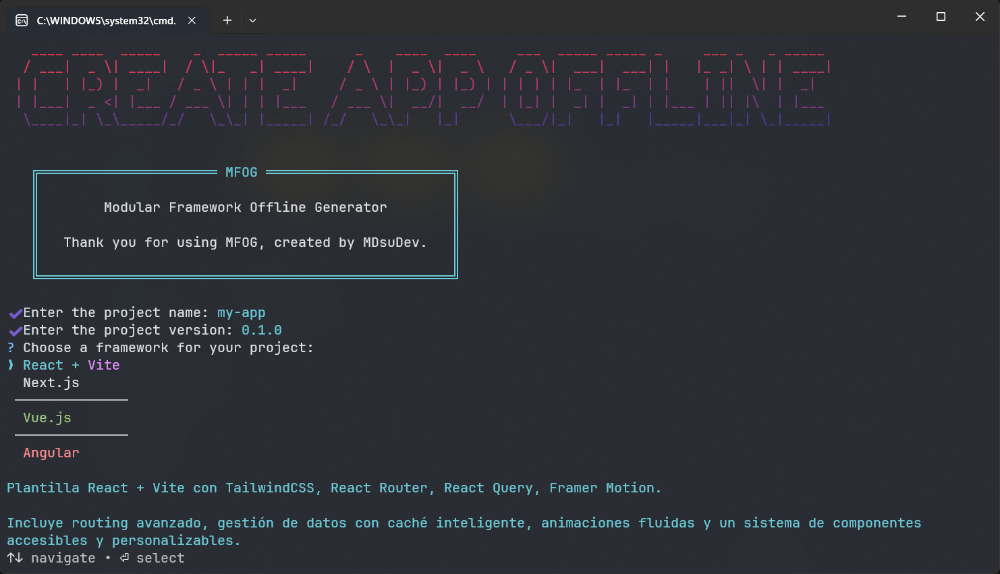
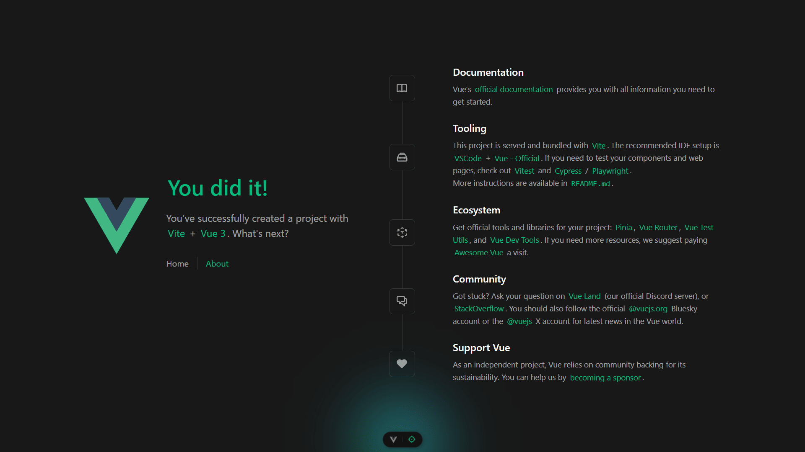
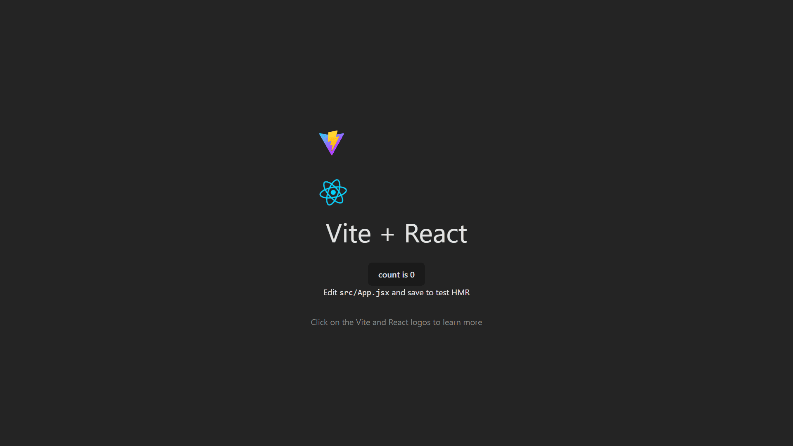
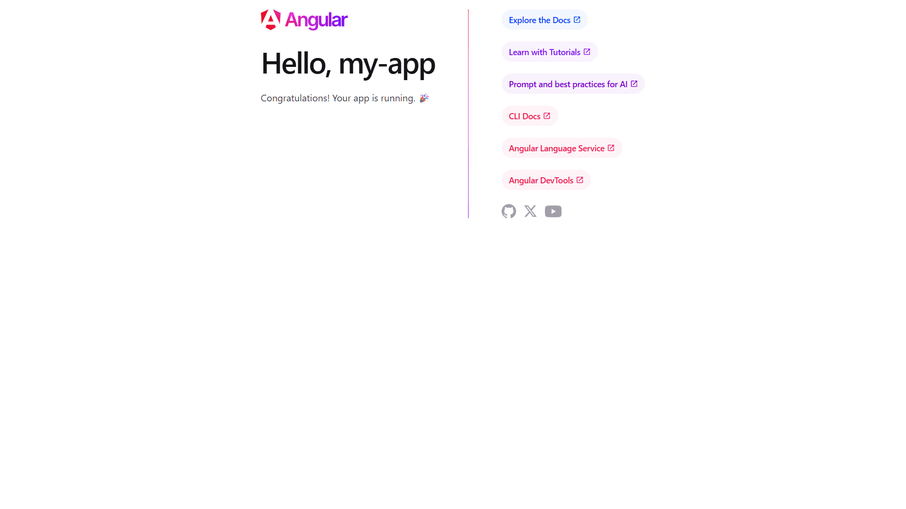

# 🚀 Modular Framework Offline Generator (MFOG)

[](https://www.npmjs.com/package/modular-framework-offline-generator)

[](https://nodejs.org/)
[](https://www.npmjs.com/package/modular-framework-offline-generator)
[](LICENSE)

## 📑 Table of Contents

- [✨ About MFOG](#-about-mfog)
- [⚙️ CLI Installation](#cli-installation)
- [🚀 Usage](#-usage)
- [📂 Accessing the generated project](#-accessing-the-generated-project)
- [🛠️ Available commands](#commands)
- [🧩 Frameworks](#frameworks)
- [📝 License](#-license)

## ✨ About MFOG

**MFOG** is an offline generator that allows you to quickly create applications using pre‑built local templates.

Its goal is to simplify the creation of basic projects without downloading templates from the internet.

<p align="center">
  
</p>

> This project is inspired by **CRAO** by **Baronsindo**.  
> You can view the original project here:  
> [CRAO Repository](https://github.com/Baronsindo/create-react-app-offline/tree/master)

## CLI Installation

To install the CLI for the first time, run:

```sh
npm install -g modular-framework-offline-generator
```

Once installed, you’ll be able to create React or Next.js applications completely offline

## 🚀 Usage

To run the app, simply execute in your terminal:

```sh
mfog
```

The program will ask you for a project name and will create a directory with that name inside the current folder.

Inside that directory, it will generate:

- The initial project structure
- Essential files
- All required dependencies (installed locally)

You won’t need to worry about complex configurations or unnecessary boilerplate.
You’ll get exactly what you need to start building your application.

## 📂 Accessing the generated project

Once the installation is complete, enter the project folder:

```sh
cd your-project-name
```

## Commands

Inside the newly created project, you can run:

```sh
npm run dev
```

This starts the development environment so you can begin working on your application.

If you created a **Vue.js** or **Next.js** project, you need to run the following command:

```sh
npm start
```

## 🧩Frameworks

<div style="display:flex; flex-wrap:wrap; justify-content:center; gap:20px;">
  <div style="text-align:center;">
    
    <div><strong>Vue</strong><br>v3.5.26</div>
  </div>
  <div style="text-align:center;">
    
    <div><strong>React</strong><br>v19.2.0</div>
  </div>
  <div style="text-align:center;">
    
    <div><strong>Angular</strong><br>v21.1.0</div>
  </div>
  <div style="text-align:center;">
    
    <div><strong>Next.js</strong><br>v16.1.1</div>
  </div>
</div>

## 📝 License

MFOG is licensed under the MIT License.  
See the [LICENSE](LICENSE) file for more details.

[](LICENSE)
